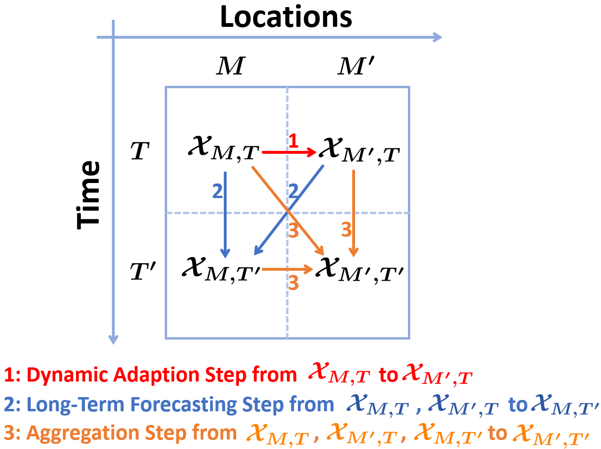

# SLPF
This is an implementation of [Spatio-temporal Partial Sensing Forecast of Long-term Traffic](https://openreview.net/pdf?id=Ff08aPjVjD)


## Overview

In this paper, we propose SLPF, a Spatial-temporal Long-term Partial sensing Forecast model for long-term traffic forecasting. SLPF introduces a rank-based node embedding to improve robustness against noise and better capture complex spatio-temporal correlations. We further design a spatial transfer module that leverages both rank-based embeddings and spatial adjacency to extract dynamic traffic patterns, enhancing adaptability and prediction accuracy. Finally, a multi-step training strategy is used for progressive model refinement. Experiments on real-world datasets show that SLPF achieves state-of-the-art accuracy in partial sensing long-term forecasting.



**Model training consists of three sequential steps:**  
1. **Dynamic adaptive step:** Trains a module with $\mathcal{X}_{M,T}$ as input and $\mathcal{X}_{M',T}$ as output.  
2. **Long-term forecasting step:** Trains a module with $\mathcal{X}_{M,T}$ and the previous module's output as input, and $\mathcal{X}_{M,T'}$ as output.  
3. **Aggregation step:** Trains a module with $\mathcal{X}_{M,T}$ and outputs from the previous two modules as input, and $\mathcal{X}_{M',T'}$ as output.  

These three modules are trained in sequence and together form the proposed SLPF.


## Requirements
* torch 
* numpy
* easydict
* tqdm
* pandas


## Dataset
PEMS03, PEMS04, and PEMS08 already downloaded and preprocessed in ```data``` folder

PEMS-BAY and METR-LA can be downloaded here [this repo](https://github.com/chnsh/DCRNN_PyTorch/tree/pytorch_scratch/data/sensor_graph) and [this Google Drive](https://drive.google.com/drive/folders/10FOTa6HXPqX8Pf5WRoRwcFnW9BrNZEIX) 

Also, we provide the all data in the [Baidu Netdisk](https://pan.baidu.com/s/1TOZH1u0eC1UbCpqGxq2c9g) with the passcode 1234


## Usage
#### In terminal
- training process

```bash
cd model

python run_SLPF.py --dataset=PEMS08 --seed=6 --num_unsensed_locs=150 --lr_init=0.001 # add arguments you want
```
- inference process

```bash
cd model

python run_SLPF.py \
--dataset=LA \
--seed=6 \
--num_unsensed_locs=150 \
--mode=test \
--adp_model_path=../runs/LA/08-07-12h34m47s_LA_embed32_lyr3_lr0.001_wd0.0003_s_6_m_150/adp_best_model.pth \
--forecast_model_path=../runs/LA/08-07-12h34m47s_LA_embed32_lyr3_lr0.001_wd0.0003_s_6_m_150/forecast_best_model.pth \
--agg_model_path=../runs/LA/08-07-12h34m47s_LA_embed32_lyr3_lr0.001_wd0.0003_s_6_m_150/agg_best_model.pth
```

## Reference
If you find the paper or the repo useful, please cite it with
```
@article{
anonymous2025spatiotemporal,
title={Spatio-temporal Partial Sensing Forecast of Long-term Traffic},
author={Anonymous},
journal={Submitted to Transactions on Machine Learning Research},
year={2025},
url={https://openreview.net/forum?id=Ff08aPjVjD},
note={Under review}
}
```

